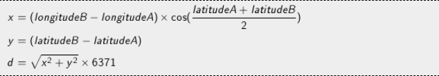

## Objectif

La ville de Montpellier a équipé ses rues de défibrillateurs pour permettre de sauver des victimes d'arrêts cardiaques. Les données correspondant à la position de tous les défibrillateurs sont accessibles en ligne.

Sur la base des données fournies dans les tests, vous décidez d'écrire un programme qui permettra aux usagers de trouver le défibrillateur le plus proche de là où ils se trouvent, grâce à leur téléphone portable.

## Règles

En entrée de votre programme sont fournies les données dont vous avez besoin, au format texte. Ces données sont notamment composées de lignes dont chacune représente un défibrillateur. Chaque défibrillateur est représenté par les champs suivants :

* Numéro identifiant le défibrillateur
* Nom
* Adresse
* Numéro de téléphone à joindre
* Longitude (en degrés)
* Latitude (en degrés)

Ces champs sont séparés par un point-virgule (;)

Attention : les nombres décimaux utilisent la virgule (,) comme séparateur pour la partie décimale. Pensez à transformer la virgule (,) en point (.) si nécessaire pour utiliser les données dans votre programme.
 
## DISTANCE

​La distance d entre deux points A et B sera calculée en utilisant la formule suivante :

Note : Dans cette formule, les latitudes et longitu​des sont exprimées en radians. 6371 correspond au rayon de la terre en km.

Le programme affichera le nom du défibrillateur se trouvant au plus près de la position de l'utilisateur. Cette position est fournie en entrée au programme.

## Entrées du jeu

### Entrée

Ligne 1 : la longitude (en degrés) de l'utilisateur

Ligne 2 : la latitude (en degrés) de l'utilisateur

Ligne 3 le nombre N de défibrillateurs équipant les rues de Montpellier

N lignes suivantes : une description de chaque défibrillateur

### Sortie

Le nom du défibrillateur le plus proche de la position de l'utilisateur.

### Contraintes

0 < N < 10000