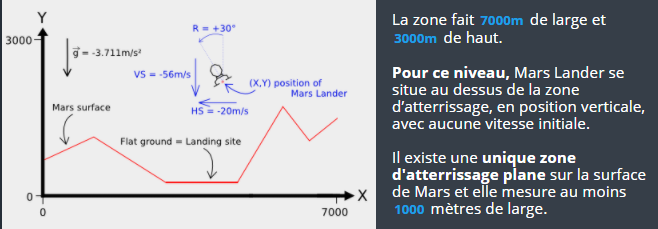
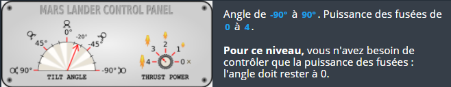

## 	Objectif

L'objectif de votre programme est de faire atterrir, sans crash, la capsule "Mars Lander" qui contient le rover Opportunity. La capsule “Mars Lander” permettant de débarquer le rover est pilotée par un programme qui échoue trop souvent dans le simulateur de la NASA.

**Notez que ce problème peut sembler difficile, mais en réalité il est simple à résoudre**. Ce puzzle constitue le premier des trois niveaux, par conséquent, certains contrôles sont présentés mais ne sont pas nécessaires pour résoudre ce premier niveau.

## Règles

Sous forme de jeu, le simulateur place Mars Lander dans une zone du ciel de Mars.

**Toutes les secondes**, en fonction des paramètres d’entrée (position, vitesse, fuel, etc.), le programme doit fournir le nouvel angle de rotation souhaité ainsi que la nouvelle puissance des fusées de Mars Lander:

Le jeu modélise **une chute libre** sans atmosphère. La gravité sur Mars est de 3,711 m/s². Pour une **puissance des fusées de X**, on génère une poussée équivalente à X m/s² et on consomme **X litres de fuel**. Il faut donc une poussée de 4 quasi verticale pour compenser la gravité de Mars.

Pour qu’un atterrissage soit réussi, la capsule doit :
* atterrir sur un sol plat
* atterrir dans une position verticale (angle = 0°)
* la vitesse verticale doit être limitée ( ≤ 40 m/s en valeur absolue)
* la vitesse horizontale doit être limitée ( ≤ 20 m/s en valeur absolue)

**Souvenez-vous que ce puzzle a été simplifié, ainsi :**
* la zone d'atterrissage est juste en dessous du robot. Vous pouvez donc ignorer la rotation et toujours indiquer 0 en angle de rotation.
* vous n'avez pas besoin de tenir compte des coordonnées de la surface.
* il vous suffit que votre vitesse d'atterrissage soit entre 0 et 40m/s.
* lorsque la capsule descend vers le sol, la vitesse verticale est négative. Lorsque la capsule s'élève dans les airs, la vitesse verticale est positive.

## Note

Pour ce **premier niveau** d'introduction, Mars Lander doit passer un unique test.

Les validateurs sont différents des tests mais restent très similaires. **Un programme qui passe un test passera le validateur correspondant** sans problème.

### Entrées du jeu

Le programme doit d'abord lire les données d'initialisation depuis l'entrée standard, puis, dans une boucle infinie, lire depuis l'entrée standard les données relatives à Mars Lander et fournir sur la sortie standard les instructions de mouvement de Mars Lander.

##  

### Entrées d'initialisation

Ligne 1 : le nombre surfaceN de points formant le sol de Mars.
Les surfaceN lignes suivantes : un couple d'entiers landX landY donnant les coordonnées d’un point du sol. En reliant les points entre eux de manière séquentielle on obtient la surface de Mars formée de segments. Pour le premier point, landX = 0 et pour le dernier point, landX = 6999.

## 

### Entrées pour un tour de jeu

Une ligne unique constituée de 7 entiers : X Y hSpeed vSpeed fuel rotate power
* X,Y sont les coordonnées en mètres de la capsule.
* hSpeed et vSpeed sont respectivement la vitesse horizontale et la vitesse verticale de Mars Lander (en m/s). Suivant le déplacement de Mars Lander, les vitesses peuvent être négatives.
* fuel est la quantité de fuel restant en litre. Quand le fuel vient à manquer, la puissance des fusées tombe à zéro.
rotate est l’angle de rotation de Mars Lander en degré.
* power est la puissance des fusées de la capsule.

## 

### Sortie pour un tour de jeu

Une ligne unique constituée de 2 entiers : rotate power
* rotate est l’angle de rotation souhaité pour Mars Lander. à noter que la rotation effective d’un tour à l’autre est limitée à +/- 15° par rapport à l’angle du tour précedent.
* power est la puissance des fusées. 0 = éteintes. 4 = puissance maximum. La puissance effective d'un tour à l'autre est limitée à +/- 1.

## 

## Contraintes

2 ≤ surfaceN < 30
0 ≤ X < 7000
0 ≤ Y < 3000
-500 < hSpeed, vSpeed < 500
0 ≤ fuel ≤ 2000
-90 ≤ rotate ≤ 90
0 ≤ power ≤ 4
Temps de réponse pour un tour ≤ 100ms

