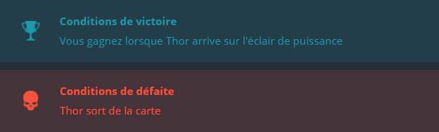

## Objectif

Votre programme doit permettre à Thor de rejoindre l'éclair de puissance.

## 	Règles

Thor évolue sur une carte de 40 cases de large et 18 cases de hauteur. Notez que les coordonnées (X et Y) commencent en partant du haut ! Ainsi la case la plus en haut à gauche a pour coordonnées "X=0,Y=0" et celle située le plus en bas à droite a pour coordonnées "X=39,Y=17".

**Au début du programme** vous recevez :

* la variable lightX : la position X de l'éclair que Thor doit rejoindre.
* la variable lightY : la position Y de l'éclair que Thor doit rejoindre.
* la variable initialTX : la position X initiale de Thor.
* la variable initialTY : la position Y initiale de Thor.

**À la fin du tour de jeu**, vous devez afficher la direction que Thor doit prendre parmi :

Chaque déplacement fait bouger Thor de 1 case dans la direction choisie.

## Note

N'oubliez pas d'exécuter les tests depuis la fenêtre "Jeu de tests".
**Attention** : les tests fournis et les validateurs utilisés pour le calcul du score sont légèrement différents pour éviter les solutions codées en dur

### Entrées de jeu

Le programme doit d'abord lire les données d'initialisation depuis l'entrée standard, puis, dans une boucle infinie fournir sur la sortie standard les instructions de mouvement de Thor.

##

#### Entrées d'initialisation

Ligne 1 : Le nombre N de températures à analyser.

Ligne 2 : Une chaine de caractères contenant les N températures exprimées sous la forme de nombres entiers allant de -273 à 5526

#### Sortie

Affichez 0 (zéro) si aucune température n'est fournie. Sinon, affichez la température la plus proche de 0

#### Contraintes

0 ≤ N < 10000
